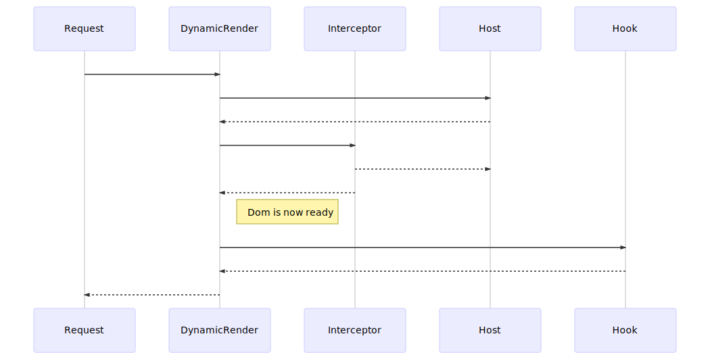

# Dynamic Render
Optimizes SEO by dynamically rendering javascript powered websites 

[](https://circleci.com/gh/Trendyol/dynamic-render) [](https://codecov.io/gh/Trendyol/dynamic-render) [](https://www.npmjs.com/package/dynamic-render)

## Guide
* [Install](#install)
* [Getting Started](#getting-started)
* [Render Cycle](#render-cycle)
* [Interceptors](#interceptors)
* [Hooks](#hooks)
* [Page](#page)
* [Application](#application)


## Install

```bash
npm install dynamic-render
```

## Getting Started
For full demo please see [Demo Folder](./demo/demo.ts)

1. First create page configuration
2. Create an application and register pages
3. Start Dynamic Render
```js
const dynamicRender = require('dynamic-render');
const examplePage = dynamicRender.page({
    name: 'example-page',
    hooks: [],
    interceptors: [],
    matcher: '/example/:pageParam',
    followRedirects: false, // Dynamic render follow the requests redirects and respond directly to browser. Default "followRedirects" is true.
});

dynamicRender.application('example-web', {
  pages: [examplePage],
  origin: 'https://example-site.com'
});

dynamicRender
  .start()
  .then(port => {
    console.log(`Prerender listening on ${port}`);
  });
```

*(Optional) You can pass configuration parameters for debugging purposes*
```js
const config = {
  puppeteer: {
    headless: false,
    ignoreHTTPSErrors: true,
    devtools: true,
  },
  port: 8080
}

dynamicRender
  .start(config)
  .then(port => {
    console.log(`Prerender listening on ${port}`);
  });
```

Now you can send request to `http://localhost:8080/render/example-web/example/35235657`, dynamic render will respond with rendered content.


### Render Cycle

<!-- https://mermaidjs.github.io/mermaid-live-editor/#/edit/eyJjb2RlIjoic2VxdWVuY2VEaWFncmFtXG4gICAgcGFydGljaXBhbnQgUmVxdWVzdFxuICAgIHBhcnRpY2lwYW50IER5bmFtaWNSZW5kZXJcbiAgICBwYXJ0aWNpcGFudCBJbnRlcmNlcHRvclxuICAgIHBhcnRpY2lwYW50IEhvc3RcbiAgICBwYXJ0aWNpcGFudCBIb29rXG4gICAgUmVxdWVzdC0-PkR5bmFtaWNSZW5kZXI6IC9yZW5kZXIvYXBwL3BhZ2UvMTJcbiAgICBEeW5hbWljUmVuZGVyLT4-SG9zdDp7YXBwbGljYXRpb24ub3JpZ2lufS9wYWdlLzEyXG4gICAgSG9zdC0tPj5EeW5hbWljUmVuZGVyOkh0bWwgQ29udGVudFxuICAgIER5bmFtaWNSZW5kZXItPj5JbnRlcmNlcHRvcjpBc3NldChpbWcucG5nKVxuICAgIEludGVyY2VwdG9yLS0-Pkhvc3Q6KGltZy5wbmcgbm90IGhhbmRsZWQpXG4gICAgSW50ZXJjZXB0b3ItLT4-RHluYW1pY1JlbmRlcjooaW1nLnBuZyBibG9ja2VkIG9yIGhhbmRsZWQpXG4gICAgTm90ZSByaWdodCBvZiBEeW5hbWljUmVuZGVyOiBEb20gaXMgbm93IHJlYWR5XG4gICAgRHluYW1pY1JlbmRlci0-Pkhvb2s6RG9tXG4gICAgSG9vay0tPj5EeW5hbWljUmVuZGVyOiBVcGRhdGVkIERvbVxuICAgIER5bmFtaWNSZW5kZXItLT4-UmVxdWVzdDovcmVuZGVyL2FwcC9wYWdlLzEyXG4gICAgXG4gICAgXG4gICAgIiwibWVybWFpZCI6eyJ0aGVtZSI6ImRlZmF1bHQifX0 -->

--------

### Interceptors
Interceptors are responsible for modifying or blocking http requests. For optimizing rendering performance you may want to mock assets. Best use case for interceptors is handling image requests.

```js
const dynamicRender = require('dynamic-render');
const placeholderPng = fs.readFileSync(path.join(__dirname, './png_placeholder'));
const imageInterceptor = dynamicRender.interceptor({
  name: 'Image Interceptor',
  handler: (req, respond) => {
    const url = req.url();
    if (url.endsWith('png')) {
      respond({
        body: placeholderPng,
        contentType: 'image/png'
      })
    }
  }
});
```

Interceptors can be shared across pages. To register an interceptor to a page you use interceptors property of it.
```js
const examplePage = dynamicRender.page({
    name: 'example-page',
    hooks: [],
    interceptors: [imageInterceptor],
    matcher: '/example/:pageParam'
});
```
--------

### Hooks

Hooks are responsible for modifying loaded dom content. Best use case for hooks is removing unnecessary assets for Google. As page is already rendered with clientside javascript, they are useless now.

```js
const dynamicRender = require('dynamic-render');
const clearJS = dynamicRender.hook({
  name: 'Clear JS',
  handler: async (page) => {
    await page.evaluate(() => {
      const elements = document.getElementsByTagName('script');
      while (elements.length > 0) {
        const [target] = elements;
        target.parentNode.removeChild(target);
      }
    });
  },
})
```

Hooks can be shared across pages. To register a hook to a page you use hooks property of it.

**Example hooks:**

<details>

**Remove comments from DOM**

> Comments for humans, not for search engine scrapers.

```javascript
/* eslint-disable no-cond-assign */
import dynamicRender from 'dynamic-render';

const clearComments = dynamicRender.hook({
  name: 'Clear comments',
  handler: async (page) => {
    await page.evaluate(() => {
      const nodeIterator = document.createNodeIterator(
        document,
        NodeFilter.SHOW_COMMENT,
      );
      let currentNode;

      while (currentNode = nodeIterator.nextNode()) {
        currentNode.parentNode.removeChild(currentNode);
      }
    });
  },
});
```

**Async DOM element handler**

> We're reducing DOM asset size with CDN's. Also we detach from DOM, when user intercept specific area, we load it. Called as lazy load. Dynamic render can trigger intercept and wait lazy loading.

```javascript

import dynamicRender from 'dynamic-render';

const loader = (name, container, element, lazyImage) => dynamicRender.hook({
  name,
  handler: async (page) => {
    const containerExists = await page.evaluate((container) => {
      const containerElement = document.querySelector(container);
      if (containerElement) {
        window.scrollBy(0, containerElement.offsetTop);
      }
      return Promise.resolve(!!containerElement);
    }, container);
    if (containerExists) {
      await page.waitForSelector(`${element} ${lazyImage}`, {
        timeout: 1000,
      }).catch(() => true);
    }
  },
});

// Usage:
/*
const waitForLoad = loader('name-it', '#spesific-div', '#spesific-part', 'img[src*="cool-cdn-url"]');
*/
```

*Feel free to publish your killer hooks with world!*

</details>

**Usage:**

```js
const examplePage = dynamicRender.page({
    name: 'example-page',
    hooks: [clearJS],
    interceptors: [],
    matcher: '/example/:pageParam'
});
```

--------

### Page

Pages represent your controllers. An application might have multiple pages and you can provide different configurations for them.
```js
const productDetailPage = dynamicRender.page({
  name: 'product-detail',
  hooks: [jsAssetCleaner],
  interceptors: [imageInterceptor],
  matcher: '/example/:pageParam',
  emulateOptions: {
    userAgent: 'Mozilla/5.0 (iPhone; CPU iPhone OS 11_0 like Mac OS X) AppleWebKit/604.1.38 (KHTML, like Gecko) Version/11.0 Mobile/15A372 Safari/604.1',
    viewport: {
      width: 414,
      height: 736,
      deviceScaleFactor: 3,
      isMobile: true,
      hasTouch: true,
      isLandscape: false
    }
  },
  waitMethod: 'load',
  query: {
    test: 12345,
    qa: 'GA-XXXXX'
  },
  followRedirects: true
});
```

| Property       | Required | Description                                                   |
|----------------|----------|---------------------------------------------------------------|
| name           | true     | Name of the page                                              |
| hooks          | false    | Array of Hooks                                                |
| interceptors   | false    | Array of Interceptors                                         |
| matcher        | true     | Matches url with page. Express-like matchers are accepted     |
| emulateOptions | false    | Default values are provided below, rendering options          |
| waitMethod     | false    | Default value is 'load', you can check Puppeteer wait methods |
| query          | false    | Default value is '{}', you can pass query strings to matched url |
| followRedirects          | false    | Default value is 'true', you can pass false for not for follow incoming redirects. |

Default emulate options are

```js
{
    userAgent: 'Mozilla/5.0 (iPhone; CPU iPhone OS 11_0 like Mac OS X) AppleWebKit/604.1.38 (KHTML, like Gecko) Version/11.0 Mobile/15A372 Safari/604.1',
    viewport: {
        width: 414,
        height: 736,
        deviceScaleFactor: 3,
        isMobile: true,
        hasTouch: true,
        isLandscape: false
    }
}
```

Page emulate options are not required when emulateOptions provided at application level. If you want to override application level configuration you can use page emulate options. 

--------

### Application
Applications are the top level configuration for hosts

```js
dynamicRender.application('mobile-web', {
  pages: [productDetailPage],
  origin: 'https://m.trendyol.com'
});
```

| Property       | Required | Description                                              |
|----------------|----------|----------------------------------------------------------|
| pages          | true     | Array of Pages                                           |
| origin         | true     | http://targethost.com                                    |
| emulateOptions | false    | Application level emulate options that affects all pages |
